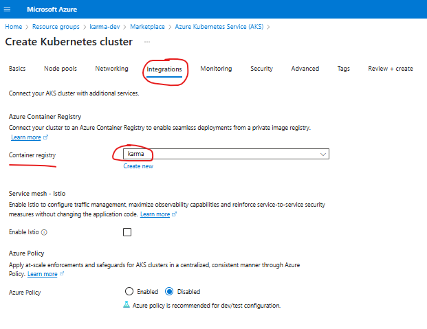
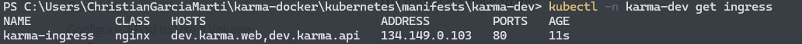
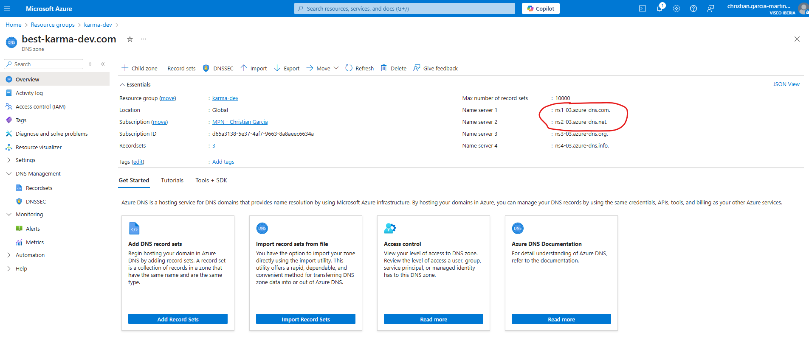

## Index

## Resources 
1. - [Create rg](#create-rg)
2. - [Create acr](#create-acr)
3. - [Create cluster](#create-cluster)
4. - [Acr pull role for cluster](#acr-pull-role-for-cluster)

## Images
1. - [Push images to acr](#push-images-to-acr)


## K8s Resources
- [Namespace resource](#namespace-resource)
- [Api resource](#api-resource)
- [Web resource](#web-resource)
- [Expose deployments](#expose-deployments)

## Ingress
- [Install ingress](#install-ingress)

## Domain Service
- [Create domain service](#create-domain-service)
- [Create domain third party](#create-domain-third-party)

## Ssl cert
- [Create valid ssl cert](#create-valid-ssl-cert)

## Create rg
- [Index](#index)


## Create acr
- [Index](#index)


## Create cluster
- [Index](#index)




## Acr pull role for cluster
- [Index](#index)


## Push images to acr
- [Index](#index)

1. 

2. log in acr
```
docker login <nombre-del-registro>.azurecr.io -u <usuario> -p <contraseña>
```
3. push images
```
docker push karma.azurecr.io/karma-web:0.0.15
```
```
docker push karma.azurecr.io/karma-api:0.0.33
``` 

## Namespace resource
- [Index](#index)

1. We need an space inside the cluster to keep all the k8s resources regard environment,
so we create the manifest for the ns using ``` --dry-run=client ``` option
```
kubectl create ns karma-dev --dry-run=client -o yaml > karma-dev-ns.yml
```

2. Create the resource inside the cluster
```
kubectl apply -f karma-dev-ns.yml
```

from now all the resources created need to be in the karma-dev ns context


## Api resource 
- [Index](#index)

1. Label a node for affinity, in the example of bellow we create the label 
``` nodeidentifier=worker1 ``` for the node ``` aks-agentpool-52131993-vmss000000 ```
```
kubectl label node aks-agentpool-52131993-vmss000000 nodeidentifier=worker1
```

2. Check label was created 
    - windows powershell

    ``` kubectl get node aks-agentpool-52131993-vmss000000 -o yaml | Select-String -Pattern 'nodeidentifier' ```
    - linux terminal

    ``` kubectl get node aks-agentpool-52131993-vmss000000 -o yaml | grep -i 'nodeidentifier' ```

2. Create the yml manifest for a basic api deployment that
pull an image from the acr named karma image sample ``` karma.azurecr.io/karma-api:0.0.33 ```
```
kubectl -n karma-dev create deploy karma-dev-api --image=karma.azurecr.io/karma-api:0.0.33 --dry-run=client -o yaml > deploy-karma-dev-api.yml
```

3. open manifest file and add the nodeSelectors
```
code ./deploy-karma-dev-api.yml
```
add these lines
```
spec:
  replicas: 1
  selector:
    matchLabels:
      app: karma-dev-api
  strategy: {}
  template:
    metadata:
      creationTimestamp: null
      labels:
        app: karma-dev-api
    spec:
      containers:
      - image: karma.azurecr.io/karma-api:0.0.33
        name: karma-api
        resources: {}
        ports:d # add this line
          - containerPort: 8080d # add this line
      nodeSelector:d # add this line
        nodeidentifier: worker1d # add this line
```


4. Create resource in the cluster
```
kubectl apply -f ./deploy-karma-dev-api.yml
```

## Web resource
- [Index](#index)

1. Create the web deployment
```
kubectl -n karma-dev create deploy karma-dev-web --image=karma.azurecr.io/karma-web:0.0.14 --dry-run=client -o yaml > deploy-karma-dev-web.yml
```
2. add these lines:


3. Create the resource
```

```

## Expose deployments
- [Index](#index)

1. Create svc of type LoadBalancer manifest to expose API
```
kubectl -n karma-dev expose deploy karma-dev-api --name=karma-dev-api --type=LoadBalancer --target-port=8080 --port=3030 --dry-run=client -o yaml > svc-karma-dev-api.yml
```
   - port: the port where the service will host the container sample ``` http://<external-svc-ip>:<svc-port>/swagger/index.html ```
   - targetport: is the port inside the container where the svc will redirect the incoming traffic

2. Checkt manifest and Create service that expose the deployment
```
kubectl apply -f ./svc-karma-dev-api
```

3. Create svc of type LoadBalancer manifest to expose Web deploy where is living a pod , this is pod has a
container exposing Angular app in port 4200
```
kubectl -n karma-dev expose deploy karma-dev-web --name=karma-dev-web --type=LoadBalancer --target-port=4200 --port=4200 --dry-run=client -o yaml > svc-karma-dev-web.yml
```

## Install ingress
- [Index](#index)

by azure


or nginx ❤️

[follow always official nginx docs](https://docs.nginx.com/nginx-ingress-controller/installation/installing-nic/installation-with-manifests/)

sample nginx , and add it to ingress-karma.yml 

```
apiVersion: networking.k8s.io/v1
kind: Ingress
metadata:
  name: karma-ingress
  namespace: karma-dev
  annotations:
    nginx.ingress.kubernetes.io/rewrite-target: /
spec:
  ingressClassName: nginx
  rules:
  - host: front.best-karma-dev.com
    http:
      paths:
      - path: /
        pathType: Prefix
        backend:
          service:
            name: karma-dev-web
            port:
              number: 4200
  - host: api.best-karma-dev.com
    http:
      paths:
      - path: /
        pathType: Prefix
        backend:
          service:
            name: karma-dev-api
            port:
              number: 3030

```

why ``` host: dev.karmawebdev.com ```
becouse you set a domain service karmawebdev.com linked to a dns zone karmawebdev.com with a record named dev

If everything is fine you'll see external ip for your ingress

## Get ingress ip address


## Create domain service
- [Index](#index)

## Create domain third party
- [Index](#index)

1. let's use [squarespace](https://account.squarespace.com/) , purchase a domain and create domain and paste azure domain name servers
go to the DNS zone and copy the first two domain name servers



2. and paste here in squarespace


3. [Get ingress ip address](#get-ingress-ip-address)

4. create your records my example ``` api.best-karma-dev.com ``` adn ``` front.best-karma-dev.com ```
and add them to the hosts of ingress


## Create valid ssl cert
- [Index](#index)

1. Install with helm
```
helm repo add jetstack https://charts.jetstack.io
```

2. Update helm repos
```
helm repo update
```

3. Install cert-manager
``` helm install cert-manager jetstack/cert-manager --namespace cert-manager --create-namespace --version v1.12.0 --set installCRDs=true ```

4. Install cert manager
```
helm install cert-manager jetstack/cert-manager --namespace cert-manager --create-namespace
```

5. Verify installation and pods are running
```
kubectl get pods -n cert-manager
```


5. Install crd's
```
kubectl apply -f https://github.com/jetstack/cert-manager/releases/download/v1.12.0/cert-manager.crds.yaml
```

6. Create service principal
```
az ad sp create-for-rbac --name "cert-manager-dns" --role "DNS Zone Contributor" --scopes /subscriptions/d65a3138-5e37-4af7-9663-8a8aeec6634a/resourceGroups/karma-dev/providers/Microsoft.Network/dnszones/best-karma-dev.com
```

pick values from json
```
{
  "appId": "appId or clientId",
  "displayName": "cert-manager-dns",
  "password": "password",
  "tenant": "tenant"
}
```

7. run this command
```
kubectl create secret generic azure-dns-secret --namespace cert-manager --from-literal=client-secret=<password>
```

8. Create Cluster issuer
```
kubectl apply -f karma-cluster-issuer.yml
```

helm install cert-manager jetstack/cert-manager --namespace cert-manager --create-namespace --version v1.14.1 --set installCRDs=true
